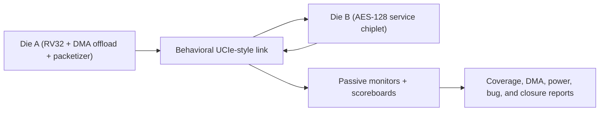

# UCIe Chiplet SoC Project

This repository stages a two-die extension of the original three-domain RISC-V SoC. The original project lives under `base_soc/` and remains available as supporting earlier work. The flagship project lives under `chiplet_extension/`, where the behavioral UCIe-style link, a CSR-programmable cross-die DMA crypto offload path, a banked local memory subsystem with parity and retention semantics, AES-backed services, and a coverage-driven Verilator DV flow now carry the strongest verification evidence in the repo.

## Verification Snapshot

The current resume-facing metrics are generated from canonical report CSVs in
[`docs/project_metrics.md`](/home/esgha/ucie_chiplet_soc/docs/project_metrics.md).
The core evidence set is stable regression closure, functional coverage,
low-power proxy coverage, bounded assertion checks, and expected bug-validation
failures. Optional UVM, seeded-random stress, and characterization lanes are
supporting evidence rather than the default closure gate.

Current core snapshot:

- Stable runs meeting expectation: `64 / 64`
- Stable functional coverage: `60 / 60` bins
- Low-power proxy tests meeting expectation: `20 / 20`
- Expected bug-validation failures: `5 / 5`
- Assertion inventory: `31` protocol/control invariants
- LibreLane ASIC flow: complete end-to-end, with DRC/LVS passing and residual antenna/max slew/max cap warnings still documented




> Verification closure roadmap
>
> The stable suite is fully green, injected bug modes are validated, the DMA offload subsystem is covered in the default gate, and the low-power proxy suite is green with UPF-aligned functional coverage. Remaining work is optional extension work rather than basic closure.

```
ucie_chiplet_soc/
├── base_soc/              # Exact copy of RISCV_Project (rtl/sim/upf/scripts)
├── chiplet_extension/     # Flagship dual-die RTL, DV flow, reports, and OpenLane config
│   ├── rtl/               # Die-A/B, adapters, PHY/channel, top wrappers
│   ├── sim/               # SystemVerilog benches, DV packages, named tests
│   ├── upf/               # Tool-neutral UPF 4.0 chiplet power intent
│   ├── reports/           # Curated summaries; raw per-run artifacts are generated locally
│   ├── scripts/           # Verilator regression and report-generation tools
│   ├── Makefile           # Verilator DV targets
│   └── openlane/          # LibreLane/OpenLane configuration stub
└── docs/                  # DV docs, diagrams, and waveform captures
```

## Architecture at a Glance

- **Die A (Compute chiplet)**
  - Generates 64‑bit plaintext words via `die_a_system.sv`.
  - Packetizes data into 256‑bit FLITs (`flit_packetizer.sv`), tracks credits, and drives the UCIe adapter (`ucie_tx.sv` / `ucie_rx.sv`).
  - Includes a CSR-programmable queued DMA offload controller with `256 x 64-bit` source/destination local memories, a 4-entry submit queue, a 4-entry completion FIFO, interrupt-driven completion, timeout/error handling, and monitor-only DMA status outputs.
  - The local memories are implemented as 2-bank scratchpads with staged maintenance access, parity checking, conflict accounting, and per-bank retained vs invalid behavior across modeled low-power states.
  - Includes a mirrored `aes128_iterative.sv` engine to produce the expected ciphertext for scoreboard checks.

- **Die B (Crypto chiplet)**
  - Accepts FLITs from the link, depacketizes them, and aggregates two 64‑bit words into 128‑bit AES blocks.
  - Runs a full iterative AES-128 encryption (`die_b/aes128_iterative.sv`) and streams the ciphertext back toward Die A over the return path.

- **UCIe Behavioral Link**
  - `d2d_adapter/` contains flow control, CRC, retry, and link management logic mirroring the UCIe device adapter features.
  - `phy_model/phy_behavioral.sv` and `channel_model/channel_model.sv` add pipeline latency, jitter, crosstalk-induced skew, and stochastic error injection.
  - `soc_chiplet_top.sv` ties the dice together with direct signal wiring and exposes monitors for plaintext and ciphertext streams. (The `ucie_lane_if.sv` interface definition is available if you choose to reintroduce it.)

- **Power Intent**
  - `chiplet_extension/upf/chiplet_full.upf` defines tool-neutral UPF 4.0 intent for the dual-die system, including always-on glue, switchable traffic/DMA/link/crypto/channel domains, switches, output isolation, DMA retention, and the chiplet power-state table. The legacy `die_a.upf`, `die_b.upf`, and `pst_chiplet.upf` files source the canonical intent as compatibility entrypoints.

## Power Intent (UPF) in This Project

The repository uses UPF to capture power intent separately from RTL so the design can be power-aware without hard-coding supply behavior into logic. There are three layers:

- **Base SoC reference (`base_soc/upf/`)**: a complete, working example of how the original single-die SoC expresses power intent.
  - Defines three domains (`AON`, `PD1`, `PD2`), explicit supply ports/nets, and two power switches (`PS_PD1`, `PS_PD2`) driven by RTL control signals (`pd1_sw_en`, `pd2_sw_en`).
  - Applies **isolation** on PD1/PD2 outputs with clamp-to-0 behavior tied to `iso_pd1_n`/`iso_pd2_n`.
  - Applies **retention** to AES key flops in PD2, with explicit save/restore controls (`save_pd2`, `restore_pd2`).
  - Declares a **power-state table** in `base_soc/upf/pst.upf` (RUN, SLEEP, CRYPTO_ONLY, DEEP_SLEEP) that matches the control sequencing used by the RTL power controller.

- **Chiplet extension UPF intent (`chiplet_extension/upf/chiplet_full.upf`)**: a tool-neutral UPF 4.0 package for the dual-die system.
  - Partitions the chiplet top into `AON_CHIPLET`, Die A traffic/DMA/link domains, Die B crypto/link domains, and the behavioral channel domain.
  - Declares switched supplies, power switches, clamp-to-0 output isolation, DMA sleep-context retention, DMA memory-bank retention capability, and the RUN / CRYPTO_ONLY / SLEEP / DEEP_SLEEP PST.
  - Binds these strategies to internal RTL sideband controls generated from the existing `power_state[1:0]` input.

- **Signoff gap**: the chiplet UPF is complete declarative intent, but it has not been validated with a commercial UPF-aware simulator, synthesis, or implementation flow. Minor tool-dialect cleanup may still be needed for a specific signoff tool.

### Techniques and Value

- **Domain partitioning** separates always-on control from switchable compute/crypto, which is essential for modeling sleep and crypto-only modes cleanly.
- **Explicit isolation/retention** in UPF (already demonstrated in `base_soc/`) keeps signal integrity and AES key state consistent across power transitions, enabling realistic low-power verification.
- **Cross-die PST** gives a single source of truth for allowed die combinations (e.g., compute-off/crypto-on), which is critical once the UCIe fabric spans distinct power islands.
- **Separation of concerns** keeps RTL functional and the power policy in UPF, which makes later power-aware simulation, synthesis, and sign-off tooling possible without RTL churn.

## Simulation Flow

The chiplet DV flow is Verilator-based.

```bash
cd chiplet_extension
make chiplet-sim      # quick smoke run: prbs_smoke + soc_smoke
make regress          # stable suite + power-proxy + bug validation
make closure          # non-UVM functional/power/bug closure gate
make closure-equivalence # compare UVM and non-UVM closure evidence
make project-check     # refresh the core non-UVM evidence bundle
make power-regress    # standalone power-proxy suite
make formal-check     # bounded Verilator property appendix
make assertion-inventory # generate assertion inventory documentation
make upf-check        # static tool-neutral UPF intent sanity check
make dma-retry-waveform # regenerate deterministic DMA retry debug PNG
make uvm-check-env    # optional full-UVM lane preflight
make uvm-smoke        # optional full-UVM smoke test
make uvm-closure      # optional UVM closure lane
make uvm-regress      # alias for UVM closure
make stress           # exploratory retry/fault stress suite
make random-smoke-25  # optional seeded-random manifest + representative run
make stress-retry-50  # optional retry-stress manifest + representative run
make power-dma-cross-25 # optional power/DMA-cross manifest + representative run
make random-stress-run # execute bounded 25/10/5 seeded-random stress subset
make random-stress-summary # summarize optional 25/50/25 seeded-random collateral
make bug-validate     # bug-mode-only validation
make characterize     # protocol/performance tables
make performance-report # resume-friendly latency/throughput summary
make chiplet-report   # regress + bounded appendix + characterization
```

The benches (`tb_ucie_prbs.sv` and `tb_soc_chiplets.sv`) now use named tests,
lightweight config objects, reusable protocol assertions, machine-readable
`DV_RESULT|...` lines, and shared Python post-processing. The default
regression regenerates:

- `chiplet_extension/reports/regress_summary.csv`
- `chiplet_extension/reports/coverage_summary.csv`
- `chiplet_extension/reports/failure_buckets.csv`
- `chiplet_extension/reports/top_failures.md`
- `chiplet_extension/reports/verification_dashboard.md`
- `chiplet_extension/reports/regression_history.csv`
- `chiplet_extension/reports/closure_targets.md`
- `chiplet_extension/reports/power_state_summary.csv`
- `chiplet_extension/reports/coverage_closure_matrix.md`
- `chiplet_extension/reports/cross_coverage_summary.csv`
- `chiplet_extension/reports/closure_equivalence.csv`
- `chiplet_extension/reports/closure_equivalence.md`
- `chiplet_extension/reports/formal_summary.csv`
- `chiplet_extension/reports/perf_characterization.csv`
- `docs/protocol_characterization.md`
- `docs/performance_characterization.md`
- `docs/assertion_inventory.md`
- `docs/random_stress_summary.md`
- `docs/uvm_status.md`
- `docs/bug_validation_cases.md`

Additional optional collateral includes seeded-random manifests and bounded
stress execution summaries under
`chiplet_extension/reports/*_manifest.csv`, the assertion inventory in
`docs/assertion_inventory.md`, the seeded-random stress summary in
`docs/random_stress_summary.md`, the UVM status note in `docs/uvm_status.md`,
the interview-facing bug diary in `docs/bug_diary.md`, and the waveform debug case study in
`docs/debug_case_study_dma_retry.md`.

The optional UVM lane writes `chiplet_extension/reports/uvm_regress_summary.csv`
and `chiplet_extension/reports/uvm_coverage_summary.csv` when `make uvm-closure`
or `make uvm-regress` is run with a valid `VERILATOR_UVM` / `UVM_HOME`
environment. `make uvm-smoke` writes `uvm_smoke_*` reports so quick UVM smoke
runs do not overwrite closure evidence. When the optional UVM environment is
available, `make closure-equivalence` compares the UVM and non-UVM closure
vectors for the same 60-bin functional target, power-proxy target, and
expected bug-validation results.

### Verification Plan Snapshot

| Feature | Stimulus | Checker | Coverage | Status |
| --- | --- | --- | --- | --- |
| DMA nominal transfer | Directed and randomized CSR sequences | Destination memory scoreboard | Queue depth, transfer size, completion type | Closed |
| DMA timeout/error path | Timeout and error injection | DMA completion and timeout checkers | Runtime-error completion, words retired, IRQ/error bins | Closed |
| Link retry/recovery | CRC fault, lane fault, and backpressure injection | Retry monitor plus FLIT scoreboard | Retry count, resend request, recovery path | Closed |
| Low-power sleep/resume | RUN / SLEEP / DEEP_SLEEP / CRYPTO_ONLY sequences | Retention, isolation, and blocked-access checks | PST state, legal transition, isolation, retention crosses | Closed |
| Power with active traffic | DMA/link traffic with backpressure, retry, CRYPTO_ONLY, and SLEEP transitions | Power monitor, DMA scoreboard, retry/link checkers | Transition-by-activity, isolation, retention, retry/resume | Closed |
| AES return path | Directed plaintext blocks and DMA traffic | AES reference model and end-to-end scoreboard | Block count, return ordering, scoreboard match | Closed |

### Coverage Breakdown

| Coverage area | Example bins |
| --- | --- |
| DMA | Submit queue occupancy, completion FIFO occupancy, queue wrap, timeout, rejected submission, retire stall |
| Link | Normal transfer, retry request, CRC fault, lane fault, backpressure, latency low/nominal/high |
| Memory | Source/destination bank conflict, wait cycles, maintenance parity error, DMA parity error, retained bank, invalidated bank |
| Power | RUN, SLEEP, DEEP_SLEEP, CRYPTO_ONLY, legal transitions, isolation active/released, retention save/restore |
| AES/service | End-to-end updates, ciphertext mismatch detection, expected-empty underflow, return ordering through scoreboards |

`chiplet_extension/reports/coverage_closure_matrix.md` contains the generated
feature-grouped closure view, metric-to-test mapping, and cross-coverage
evidence. Cross groups are quality evidence layered on top of the canonical
`60 / 60` flat-bin closure target. The bug diary in `docs/bug_diary.md` and
the exact regression diary in `docs/bug_validation_cases.md` record the five
implemented expected-fail bug modes and the checker/bucket that catches each
one. The waveform-driven retry debug case study is in
`docs/debug_case_study_dma_retry.md`.

`docs/performance_characterization.md` summarizes behavioral latency,
throughput, retry, sleep/resume, and crypto-only observations across named
traffic scenarios for resume/interview discussion.

### UVM Implementation Evaluation

The UVM implementation is useful as an architecture and methodology
demonstration, not as a replacement for the stable Verilator gate. It includes
real UVM packages for UCIe, DMA/CSR, power, and the top-level chiplet
environment, with sequence items, sequencers, drivers, monitors, scoreboards,
coverage subscribers, and virtual-interface plumbing under
`chiplet_extension/sim/uvm/`.

The intended comparison target is closure equivalence: when the optional UVM
environment is available, `make closure-equivalence` regenerates both lanes and
checks that UVM and non-UVM runs cover the same `60 / 60` functional bins,
close the same low-power proxy coverage target, and observe the same `5 / 5`
expected bug-validation failures. The default checked evidence remains the
non-UVM stable Verilator gate.

The main limitation is tool support. In the local Verilator flow, the UVM bench
uses UVM reporting plus a compatibility runner that reuses the shared named
scenario and coverage infrastructure. The checked-in non-Verilator path keeps a
normal `run_test()`/phase/TLM structure, but commercial-simulator UVM regression
has not been used as the signoff gate.

Verified in this workspace on April 26, 2026: the stable Verilator regression
completed with `64 / 64` runs meeting expectation, `59 / 59` nominal passes,
`1 / 1` randomized passes, `5 / 5` expected bug-validation failures, `19 / 19`
DMA nominal passes, `13 / 13` memory nominal passes, and `60 / 60` covered
functional bins. The bounded property appendix completed with `8 / 8` nominal
harnesses plus `1 / 1` expected failing bug demo. The low-power proxy suite was
refreshed with `20 / 20` runs meeting expectation.

For the full chiplet DV methodology and current test list, see
`chiplet_extension/README.md`.

## Physical-Design Exploration

`chiplet_extension/openlane/chiplet/config.json` is a LibreLane/OpenLane2 configuration stub targeting `soc_chiplet_top`.

The most reliable way to launch the flow in this workspace is through LibreLane's Nix shell. This pulls in the expected `yosys`, `openroad`, `magic`, `netgen`, `klayout`, `verilator`, and Python dependencies in one step:

```bash
/nix/var/nix/profiles/default/bin/nix-shell --pure <librelane-root>/shell.nix
```

Then run LibreLane from inside that shell:

```bash
cd <librelane-root>
librelane \
  --pdk-root <sky130-pdk-root> \
  <repo-root>/chiplet_extension/openlane/chiplet/config.json
```

LibreLane runs already exist under `chiplet_extension/openlane/chiplet/runs/` in this workspace. If `nix-shell` is already on your `PATH`, you can use `nix-shell --pure <librelane-root>/shell.nix` instead of the absolute `/nix/...` path above. OpenLane/OpenROAD does not support SystemVerilog `interface` constructs, so if you reintroduce `ucie_lane_if.sv` into the top-level wiring, flatten it before hardening.
  
### Quick LibreLane Run (Local PDK Example)

If you have the Ciel-managed Sky130 PDK installed locally, the exact sequence verified in this workspace is:

```bash
/nix/var/nix/profiles/default/bin/nix-shell --pure ~/librelane/shell.nix
cd ~/librelane
librelane \
  --pdk-root ~/.ciel/ciel/sky130/versions/0fe599b2afb6708d281543108caf8310912f54af \
  ~/ucie_chiplet_soc/chiplet_extension/openlane/chiplet/config.json
```

Notes:
- If your LibreLane setup uses Volare, you can replace `--pdk-root` with `--pdk sky130A`.
- The alternate config at `<repo-root>/openlane/chiplet/config.json` is equivalent; it points at the same RTL.
- Running `python3 -m librelane` directly from a plain shell may fail if the LibreLane Python environment or physical-design tools are not already on `PATH`.
- A full LibreLane run was rechecked in this workspace on April 7, 2026 and completed end-to-end, writing final GDS / DEF / LEF / SPEF / SDF / LIB outputs under `chiplet_extension/openlane/chiplet/runs/codex_asic_full_20260407/final/`.
- That run passed Magic DRC and LVS, but still reports residual antenna, max slew, and max cap warnings, so it should be described as an end-to-end physical-design bring-up rather than a clean sign-off result.

## Current Status & Outstanding Work

- LibreLane runs complete end-to-end in this workspace with a relaxed clock target (e.g., 200 ns) and produce final layout outputs, so the flow is operational.
- RTL has been refactored to remove obvious placeholders (XOR crypto, hard-coded CRC stubs) and to use a proper AES-128 core, but the flow is still functional/behavioral rather than sign-off-verified.
- The stable Verilator regression currently completes with 64 / 64 runs meeting expectation, including 59 / 59 nominal passes, 1 / 1 randomized runs, 5 / 5 expected bug-validation failures, 19 / 19 DMA nominal passes, and 13 / 13 memory nominal passes.
- The DMA offload path now adds a software-visible queued control plane on Die A with staged CSR submission, a 4-entry submit queue, a 4-entry completion FIFO, level IRQ signaling, reject logging, timeout/error handling, and Python-backed destination-memory comparison.
- The local memory subsystem behind the DMA is now banked, parity-protected, maintenance-accessible through explicit MEM_OP CSRs, and retention-aware across RUN / CRYPTO_ONLY / SLEEP / DEEP_SLEEP proxy modes.
- The low-power proxy suite currently completes with 20 / 20 runs meeting expectation and exercises modeled RUN, CRYPTO_ONLY, SLEEP, and DEEP_SLEEP states plus legal transitions, valid PST domain combinations, isolation behavior, DMA retention pulses, transition/activity crosses, active-traffic power transitions, queued-DMA sleep/resume, and retention-matrix scenarios.
- The chiplet extension now includes tool-neutral UPF 4.0 power intent with domains, supplies, switches, isolation, DMA retention, and PST definitions, plus a repo-local `make upf-check` validator. This is not yet signoff-validated by a UPF-aware commercial tool.
- An optional full-UVM lane is checked in under `chiplet_extension/sim/uvm` and is run through `make uvm-check-env`, `make uvm-smoke`, `make uvm-closure`, and `make uvm-regress` when `VERILATOR_UVM` and `UVM_HOME` point to a UVM-capable Verilator/UVM 2017 setup. It is intentionally separate from the stable Verilator gate, and its closure output can be checked for equivalence against the non-UVM lane.
- The heavier retry/fault, SoC recovery, and characterization-style sweeps are preserved as named flows rather than being silently removed.
- Timing closure is not representative yet; tighter clocks still show significant setup violations, and slow-corner max slew/max cap warnings remain.


This README will continue to evolve as characterization depth and low-power detail improve. Contributions and fixes—especially around retry/fault stress closure—are welcome.

## Lightweight Core DV Environment

The base SoC now includes a lightweight UVM-style DV environment around `base_soc/rtl/pd1_rv32/rv32_core.sv`. It keeps the structure hiring managers expect without pulling in full UVM: a clean interface, a timing-aware driver, directed plus seeded-random stimulus, a passive monitor, a scoreboard with an independent SystemVerilog reference model, simple assertions, coverage-oriented counters, and optional waveform capture.

Key files under `base_soc/sim/`:

- `rv32_core_if.sv`: single connection point shared by the DUT, driver, and monitor.
- `rv32_driver.sv`: timing-aware instruction driver with a simple `send_instruction()` task.
- `rv32_generator.sv`: directed and seeded-random instruction generation, including dependency chains, branch-heavy patterns, and load/store traffic.
- `rv32_monitor.sv`: passive transaction capture for commit trace activity.
- `rv32_scoreboard.sv`: reference-model-based checking against an independent SV predictor.
- `rv32_assertions.sv`: protocol and PC progression checks.
- `rv32_coverage.sv`: functional coverage counters plus an optional covergroup hook (`RV32_ENABLE_COVERGROUPS`).
- `tb_rv32_core.sv`: top-level control that runs directed stimulus first and then random stimulus, with optional FST dumping.
- `rv32_core_wave.gtkw`: curated GTKWave view for the instruction/commit/writeback/memory timeline.
- `rv32_core_wave_export.tcl`: GTKWave automation script that prints the curated view to PostScript.
- `Makefile`: Verilator-based build/run target that emits reports and optional waveforms under `base_soc/sim/build/`.

Run the regression with:

```bash
make -C base_soc/sim rv32-core SEED=1592642302 RAND_COUNT=48
```

Generate waveform artifacts with:

```bash
make -C base_soc/sim rv32-core-waves SEED=123456 RAND_COUNT=12
make -C base_soc/sim rv32-core-wave-print SEED=123456 RAND_COUNT=12
```

Open the saved view in GTKWave with:

```bash
gtkwave base_soc/sim/build/rv32_core_wave.fst base_soc/sim/rv32_core_wave.gtkw
```

Artifacts:

- `base_soc/sim/build/rv32_scoreboard.csv`
- `base_soc/sim/build/rv32_coverage.csv`
- `base_soc/sim/build/rv32_core_wave.fst`
- `base_soc/sim/build/rv32_core_wave.ps`

The random stream deliberately mixes ALU ops, dependency chains, branch-heavy behavior, and memory traffic so you can talk concretely about stimulus generation, checking, assertions, functional coverage, and waveform-driven debug in the same project.

### GTKWave Capture

A representative GTKWave screenshot from the lightweight RV32 DV environment is shown below. The most useful view is a short 6-10 instruction window that shows:

- `instr_valid` / `instr_ready`
- `commit_valid`
- `commit_pc` / `commit_next_pc`
- `wb_valid`, `wb_rd`, `wb_data`
- `mem_valid` / `mem_write` when load-store traffic is present
- `branch_taken` when a branch sequence is visible


