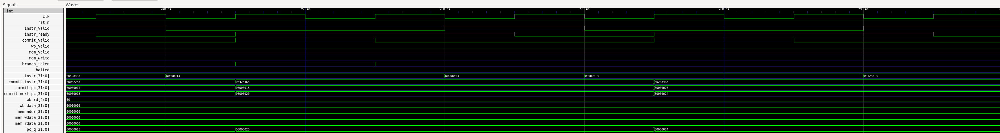

# UCIe Chiplet SoC Project

This repository stages a two-die extension of the original three-domain RISC-V SoC. The original project lives under `base_soc/` and remains untouched so you can continue to run its regressions and flows. The new work appears under `chiplet_extension/` and adds a behavioral UCIe 2.0-style link, die partitioning, AES-backed crypto services, and a lightweight coverage-driven DV flow built around Verilator, named tests, passive monitors, scoreboards, assertions, and regression dashboards.

```
ucie_chiplet_soc/
├── base_soc/              # Exact copy of RISCV_Project (rtl/sim/upf/scripts)
├── chiplet_extension/     # New RTL, benches, scripts, and OpenLane config
│   ├── rtl/               # Die-A/B, adapters, PHY/channel, top wrappers
│   ├── sim/               # SystemVerilog benches, DV packages, named tests
│   ├── upf/               # Power-intent placeholders for the two-die system
│   ├── reports/           # Regression summaries, coverage CSVs, dashboards
│   ├── scripts/           # Verilator regression and report-generation tools
│   ├── Makefile           # Verilator DV targets
│   └── openlane/          # LibreLane/OpenLane configuration stub
└── docs/                  # DV docs, diagrams, and waveform captures
```

## Architecture at a Glance

- **Die A (Compute chiplet)**
  - Generates 64‑bit plaintext words via `die_a_system.sv`.
  - Packetizes data into 256‑bit FLITs (`flit_packetizer.sv`), tracks credits, and drives the UCIe adapter (`ucie_tx.sv` / `ucie_rx.sv`).
  - Includes a mirrored `aes128_iterative.sv` engine to produce the expected ciphertext for scoreboard checks.

- **Die B (Crypto chiplet)**
  - Accepts FLITs from the link, depacketizes them, and aggregates two 64‑bit words into 128‑bit AES blocks.
  - Runs a full iterative AES-128 encryption (`die_b/aes128_iterative.sv`) and streams the ciphertext back toward Die A over the return path.

- **UCIe Behavioral Link**
  - `d2d_adapter/` contains flow control, CRC, retry, and link management logic mirroring the UCIe device adapter features.
  - `phy_model/phy_behavioral.sv` and `channel_model/channel_model.sv` add pipeline latency, jitter, crosstalk-induced skew, and stochastic error injection.
  - `soc_chiplet_top.sv` ties the dice together with direct signal wiring and exposes monitors for plaintext and ciphertext streams. (The `ucie_lane_if.sv` interface definition is available if you choose to reintroduce it.)

- **Power Intent**
  - UPF templates (`upf/die_a.upf`, `upf/die_b.upf`, `upf/pst_chiplet.upf`) define four domains (`AON_A`, `PD1_RV32`, `AON_B`, `PD2_AES`) and a cross-die power-state table (RUN, SLEEP, CRYPTO_ONLY, DEEP_SLEEP). These files mirror the structure of the base SoC but require elaboration before sign-off.

## Power Intent (UPF) in This Project

The repository uses UPF to capture power intent separately from RTL so the design can be power-aware without hard-coding supply behavior into logic. There are two layers:

- **Base SoC reference (`base_soc/upf/`)**: a complete, working example of how the original single-die SoC expresses power intent.
  - Defines three domains (`AON`, `PD1`, `PD2`), explicit supply ports/nets, and two power switches (`PS_PD1`, `PS_PD2`) driven by RTL control signals (`pd1_sw_en`, `pd2_sw_en`).
  - Applies **isolation** on PD1/PD2 outputs with clamp-to-0 behavior tied to `iso_pd1_n`/`iso_pd2_n`.
  - Applies **retention** to AES key flops in PD2, with explicit save/restore controls (`save_pd2`, `restore_pd2`).
  - Declares a **power-state table** in `base_soc/upf/pst.upf` (RUN, SLEEP, CRYPTO_ONLY, DEEP_SLEEP) that matches the control sequencing used by the RTL power controller.

- **Chiplet extension scaffolding (`chiplet_extension/upf/`)**: a UPF 4.0 template for the dual-die system.
  - Mirrors the base SoC pattern by carving each die into **always-on** and **switchable** domains (`AON_A`/`PD1_RV32`, `AON_B`/`PD2_AES`) and by defining a **cross-die PST** (`pst_chiplet.upf`) that documents the intended joint operating modes.
  - Supplies, power switches, isolation, and retention are intentionally left as placeholders so teams can insert tool-specific directives and real supply nets before sign-off.

### Techniques and Value

- **Domain partitioning** separates always-on control from switchable compute/crypto, which is essential for modeling sleep and crypto-only modes cleanly.
- **Explicit isolation/retention** in UPF (already demonstrated in `base_soc/`) keeps signal integrity and AES key state consistent across power transitions, enabling realistic low-power verification.
- **Cross-die PST** gives a single source of truth for allowed die combinations (e.g., compute-off/crypto-on), which is critical once the UCIe fabric spans distinct power islands.
- **Separation of concerns** keeps RTL functional and the power policy in UPF, which makes later power-aware simulation, synthesis, and sign-off tooling possible without RTL churn.

## Simulation Flow

The chiplet DV flow is Verilator-based.

```bash
cd chiplet_extension
make chiplet-sim      # quick smoke run: prbs_smoke + soc_smoke
make regress          # stable suite + bug validation
make stress           # exploratory retry/fault stress suite
make bug-validate     # bug-mode-only validation
```

The benches (`tb_ucie_prbs.sv` and `tb_soc_chiplets.sv`) now use named tests,
lightweight config objects, machine-readable `DV_RESULT|...` lines, and shared
Python post-processing. The default regression regenerates:

- `chiplet_extension/reports/regress_summary.csv`
- `chiplet_extension/reports/coverage_summary.csv`
- `chiplet_extension/reports/failure_buckets.csv`
- `chiplet_extension/reports/top_failures.md`
- `chiplet_extension/reports/verification_dashboard.md`

Verified in this workspace on March 30, 2026: the stable Verilator regression
was rerun after the latest ASIC-compatibility cleanup and still completed with
14 / 14 runs meeting expectation.

For the full chiplet DV methodology and current test list, see
`chiplet_extension/README.md`.

## Physical-Design Exploration

`chiplet_extension/openlane/chiplet/config.json` is a LibreLane/OpenLane2 configuration stub targeting `soc_chiplet_top`.

The most reliable way to launch the flow in this workspace is through LibreLane's Nix shell. This pulls in the expected `yosys`, `openroad`, `magic`, `netgen`, `klayout`, `verilator`, and Python dependencies in one step:

```bash
/nix/var/nix/profiles/default/bin/nix-shell --pure <librelane-root>/shell.nix
```

Then run LibreLane from inside that shell:

```bash
cd <librelane-root>
librelane \
  --pdk-root <sky130-pdk-root> \
  <repo-root>/chiplet_extension/openlane/chiplet/config.json
```

LibreLane runs already exist under `chiplet_extension/openlane/chiplet/runs/` in this workspace. If `nix-shell` is already on your `PATH`, you can use `nix-shell --pure <librelane-root>/shell.nix` instead of the absolute `/nix/...` path above. OpenLane/OpenROAD does not support SystemVerilog `interface` constructs, so if you reintroduce `ucie_lane_if.sv` into the top-level wiring, flatten it before hardening.
  
### Quick LibreLane Run (Local PDK Example)

If you have the Ciel-managed Sky130 PDK installed locally, the exact sequence verified in this workspace is:

```bash
/nix/var/nix/profiles/default/bin/nix-shell --pure ~/librelane/shell.nix
cd ~/librelane
librelane \
  --pdk-root ~/.ciel/ciel/sky130/versions/0fe599b2afb6708d281543108caf8310912f54af \
  ~/ucie_chiplet_soc/chiplet_extension/openlane/chiplet/config.json
```

Notes:
- If your LibreLane setup uses Volare, you can replace `--pdk-root` with `--pdk sky130A`.
- The alternate config at `<repo-root>/openlane/chiplet/config.json` is equivalent; it points at the same RTL.
- Running `python3 -m librelane` directly from a plain shell may fail if the LibreLane Python environment or physical-design tools are not already on `PATH`.
- A full LibreLane run was rechecked in this workspace on March 30, 2026 and completed 78 / 78 stages, writing final GDS / DEF / LEF / SPEF / SDF / LIB outputs under `chiplet_extension/openlane/chiplet/runs/codex_asic_full_20260330_004854/final/`.
- That run passed Magic DRC and LVS, but still reports residual antenna, max slew, and max cap warnings, so it should be described as an end-to-end physical-design bring-up rather than a clean sign-off result.

## Current Status & Outstanding Work

- LibreLane runs complete end-to-end in this workspace with a relaxed clock target (e.g., 200 ns) and produce final layout outputs, so the flow is operational.
- RTL has been refactored to remove obvious placeholders (XOR crypto, hard-coded CRC stubs) and to use a proper AES-128 core, but the flow is still functional/behavioral—no sign-off verification has been performed.
- The stable Verilator regression currently completes with 14 / 14 runs meeting expectation, including 4 / 4 randomized runs and one expected bug-validation failure, and that result was revalidated after the latest ASIC-flow compatibility fix.
- The default stable suite currently covers 11 / 23 functional bins. Retry / CRC / lane-fault closure remains an explicit next step rather than something hidden.
- UPF files are skeletal. Additional supply sets, isolation, retention, and power-switch definitions are needed to integrate with UPF-aware toolchains.
- The heavier retry/fault PRBS tests are preserved as an exploratory stress suite and currently bucket as `link_progress` under aggressive recovery churn.
- Timing closure is not representative yet; tighter clocks still show significant setup violations, and slow-corner max slew/max cap warnings remain.


This README will continue to evolve as coverage closure improves. Contributions and fixes—especially around retry/fault stress closure—are welcome.

## Lightweight Core DV Environment

The base SoC now includes a lightweight UVM-style DV environment around `base_soc/rtl/pd1_rv32/rv32_core.sv`. It keeps the structure hiring managers expect without pulling in full UVM: a clean interface, a timing-aware driver, directed plus seeded-random stimulus, a passive monitor, a scoreboard with an independent SystemVerilog reference model, simple assertions, coverage-oriented counters, and optional waveform capture.

Key files under `base_soc/sim/`:

- `rv32_core_if.sv`: single connection point shared by the DUT, driver, and monitor.
- `rv32_driver.sv`: timing-aware instruction driver with a simple `send_instruction()` task.
- `rv32_generator.sv`: directed and seeded-random instruction generation, including dependency chains, branch-heavy patterns, and load/store traffic.
- `rv32_monitor.sv`: passive transaction capture for commit trace activity.
- `rv32_scoreboard.sv`: reference-model-based checking against an independent SV predictor.
- `rv32_assertions.sv`: protocol and PC progression checks.
- `rv32_coverage.sv`: functional coverage counters plus an optional covergroup hook (`RV32_ENABLE_COVERGROUPS`).
- `tb_rv32_core.sv`: top-level control that runs directed stimulus first and then random stimulus, with optional FST dumping.
- `rv32_core_wave.gtkw`: curated GTKWave view for the instruction/commit/writeback/memory timeline.
- `rv32_core_wave_export.tcl`: GTKWave automation script that prints the curated view to PostScript.
- `Makefile`: Verilator-based build/run target that emits reports and optional waveforms under `base_soc/sim/build/`.

Run the regression with:

```bash
make -C base_soc/sim rv32-core SEED=1592642302 RAND_COUNT=48
```

Generate waveform artifacts with:

```bash
make -C base_soc/sim rv32-core-waves SEED=123456 RAND_COUNT=12
make -C base_soc/sim rv32-core-wave-print SEED=123456 RAND_COUNT=12
```

Open the saved view in GTKWave with:

```bash
gtkwave base_soc/sim/build/rv32_core_wave.fst base_soc/sim/rv32_core_wave.gtkw
```

Artifacts:

- `base_soc/sim/build/rv32_scoreboard.csv`
- `base_soc/sim/build/rv32_coverage.csv`
- `base_soc/sim/build/rv32_core_wave.fst`
- `base_soc/sim/build/rv32_core_wave.ps`

The random stream deliberately mixes ALU ops, dependency chains, branch-heavy behavior, and memory traffic so you can talk concretely about stimulus generation, checking, assertions, functional coverage, and waveform-driven debug in the same project.

### GTKWave Capture

A representative GTKWave screenshot from the lightweight RV32 DV environment is shown below. The most useful view is a short 6-10 instruction window that shows:

- `instr_valid` / `instr_ready`
- `commit_valid`
- `commit_pc` / `commit_next_pc`
- `wb_valid`, `wb_rd`, `wb_data`
- `mem_valid` / `mem_write` when load-store traffic is present
- `branch_taken` when a branch sequence is visible



GTKWave capture of the lightweight RV32 DV environment showing instruction handshaking, commit trace, PC progression, branch behavior, and writeback activity under directed and random stimulus.
