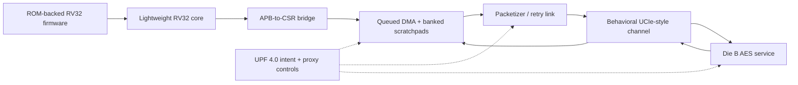

# RISC-V Chiplet SoC RTL and Verification

A dual-die RISC-V subsystem built to demonstrate firmware-driven SoC integration, queued DMA offload, low-power intent, and report-backed design verification with open-source tools. A lightweight RV32 core programs the DMA through APB MMIO; payload traffic crosses a retry-capable behavioral UCIe-style link to an AES service die.

The flagship result is the chiplet extension under `chiplet_extension/`. The earlier `base_soc/` implementation is retained only as historical context and is excluded from current project metrics.

## Architecture



The payload path is the behavioral UCIe-style transport. APB is the RV32 firmware control path. AXI-Lite is optional CSR-integration collateral and is not part of the chiplet payload path.

## Verification Snapshot

This table is generated from `chiplet_extension/reports/project_metrics.csv` by `make -C chiplet_extension readme-metrics`.

<!-- BEGIN GENERATED METRICS -->
| Evidence | Current result |
| --- | ---: |
| Stable regression | `70 / 70` |
| Functional coverage | `60 / 60` |
| Low-power proxy targets | `26 / 26` |
| RV32 firmware scenarios | `12 / 12` |
| Supporting real-UVM lane | `4 / 4` |
| Solver-backed proofs | `7 / 7` |
| Integrated async CDC ratios | `4 / 4` |
| Raw design line coverage | `96.25%` |
| Raw design toggle coverage | `1933 / 2570 (75.21%)` |
| Reviewed design toggle coverage | `1910 / 2116 (90.26%); 454 excluded` |
<!-- END GENERATED METRICS -->

The non-UVM Verilator regression remains the default functional closure gate. The pinned `4 / 4` UVM phase/TLM/RAL lane is supporting methodology evidence, not a replacement closure claim. Raw and reviewed code-coverage values, including exclusion rationale, remain separate from the `60 / 60` functional model.

## Five-Minute Reviewer Path

1. [Project metrics](docs/project_metrics.md)
2. [Verification traceability](docs/verification_traceability_matrix.md)
3. [Firmware-driven verification](docs/firmware_soc_verification.md)
4. [Power and UPF verification](docs/power_verification_plan.md)
5. [Coverage closure](docs/coverage_closure_case_study.md)
6. [Formal evidence](docs/formal_appendix.md)
7. [Bug diary](docs/bug_diary.md)
8. [Performance characterization](docs/performance_characterization.md)
9. [UVM status](docs/uvm_status.md)
10. [Documentation index](docs/README.md)

Core evidence refresh:

```bash
make -C chiplet_extension project-check
make -C chiplet_extension upf-check
```

Supporting lanes:

```bash
make -C chiplet_extension firmware-soc-check
make -C chiplet_extension formal-prove
make -C chiplet_extension async-cdc-check
make -C chiplet_extension code-coverage
make -C chiplet_extension uvm-ci
```

## Firmware-Driven DMA Flow

ROM-backed RV32 programs use the supported `ADDI`, `LW`, `SW`, `BEQ`, and `EBREAK` subset to execute real MMIO flows:

1. Stage source, destination, length, and tag fields through APB-visible CSRs.
2. Ring the DMA doorbell.
3. Wait through APB ready-state stalls without retiring the load or store early.
4. Poll IRQ and completion state.
5. Read and pop the completion record.
6. Verify destination memory and software-visible error status.

The twelve programs cover nominal and back-to-back DMA, queue-full rejection, completion-FIFO pressure, timeout, parity and invalid-memory errors, IRQ pending-then-enable, sleep/resume, CRYPTO_ONLY rejection, APB wait/error handling, and reset during a pending transfer. Testbench control may inject power, reset, or link conditions, but it does not program DMA CSRs in this lane.

## DMA and Memory

- Four-entry ordered submit queue and four-entry completion FIFO.
- Staged CSR descriptor submission with source, destination, length, and tag fields.
- Success, submission-reject, timeout, parity, and invalid-memory completion status.
- Interrupt masking, pending state, completion polling, and software acknowledgement.
- Two-bank source and destination scratchpads with parity, maintenance arbitration, wait/conflict accounting, and invalid-bank tracking.
- Independent Python transaction-level golden model for descriptor flow, AES output, return ordering, and final memory image.

## Link and Service Path

The link models credits, backpressure, latency, jitter, CRC faults, retry, lane faults, and reset/recovery behavior. It is intentionally UCIe-style rather than standards-certified UCIe. Die B provides the AES service used by the DMA return path; scoreboards compare packet ordering, ciphertext, completion records, and final destination contents.

## Low-Power Intent

The tool-neutral IEEE 1801 / UPF 4.0 package declares always-on control plus switchable Die A traffic/DMA/link, Die B crypto/link, and channel domains. It includes power switches, clamp-to-zero output isolation, DMA sleep-context retention, retention-capable DMA memories, and a four-state PST.

| State | Powered behavior | Low-power behavior |
| --- | --- | --- |
| `RUN` | All switchable domains available | Isolation released; normal DMA/link/crypto activity |
| `CRYPTO_ONLY` | DMA, link, channel, and Die B crypto remain available | Legacy Die A traffic off; new DMA submissions blocked by policy |
| `SLEEP` | Switchable traffic, link, channel, crypto, and DMA are off | DMA queue/control context retained; memory validity follows retention masks |
| `DEEP_SLEEP` | All switchable domains off | DMA control context cleared; non-retained banks become invalid/poisoned |

Verilator power tests verify proxy behavior and monitor-driven functional coverage. `make upf-check` validates static power-intent structure. Verilator does not directly simulate UPF semantics, and no commercial UPF-aware signoff is claimed.

## Verification Architecture

- SystemVerilog drivers, monitors, scoreboards, protocol assertions, and event-derived functional/cross coverage.
- Negative tests and five compile-time bug modes validating checker sensitivity.
- Forty optional, executed seeded-random stress rows with reproducible manifests.
- Named assertions covering DMA accounting, retry ordering, AXI-Lite handshakes, parity containment, isolation, and retention sequencing.
- Bounded Verilator properties plus separate solver-backed proofs, reachability covers, and expected mutation counterexamples.
- Supporting real-UVM agents, TLM analysis paths, coverage subscribers, and AXI-Lite RAL frontdoor smoke.
- Integrated two-clock CDC matrix plus standalone synchronizer/RDC collateral.

## Characterization and Implementation Evidence

Behavioral characterization reports link latency, retry overhead, backpressure, DMA queue depth, bank conflicts, parity cost proxies, retention, and invalid-memory recovery. Front-end evidence includes Verilator lint and code coverage, Yosys/LibreLane implementation proxies where supported, and generated documentation. These results are useful architecture and DV evidence, not silicon timing, power, CDC, or implementation signoff.

## Repository Layout

```text
chiplet_extension/rtl/       chiplet RTL, DMA, memory, link, CDC, and integration
chiplet_extension/sim/       procedural and UVM verification collateral
chiplet_extension/formal/    solver and bounded-property harnesses
chiplet_extension/upf/       tool-neutral UPF 4.0 power intent
chiplet_extension/scripts/   regressions, models, reports, and checks
chiplet_extension/reports/   canonical normalized evidence
docs/                        primary reviewer documentation
docs/reference/              generated and specialist supporting collateral
base_soc/                    historical predecessor, excluded from flagship metrics
```

## Limitations

- The RV32 core is intentionally lightweight and is not a complete privileged or production RISC-V implementation.
- The die-to-die link is behavioral UCIe-style transport, not UCIe compliance.
- AXI-Lite is optional CSR wrapper collateral; firmware uses APB MMIO.
- UVM is a supporting lane; the stable non-UVM Verilator suite remains the closure gate.
- UPF, CDC/RDC, formal, synthesis, timing, power, and physical results are open-source verification proxies rather than commercial signoff.
- Cache coherence, DRAM, PCIe, production firmware, and additional power domains are intentionally out of scope.

## Project History

The project began as a small RV32 SoC and was extended in stages into the current firmware-controlled chiplet subsystem. Historical material remains available for provenance, but current claims and release metrics are generated only from the chiplet extension’s canonical reports.
