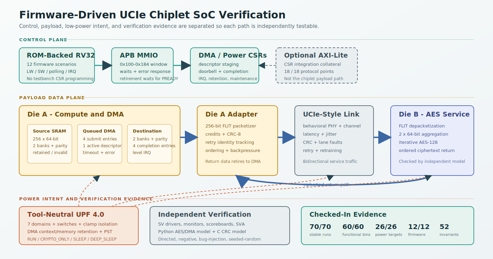

# UCIe Chiplet Extension for the Power-Aware RISC-V SoC

`chiplet_extension/` is the flagship part of this repository. It turns the
original single-die RISC-V SoC into a dual-die system linked by a behavioral
UCIe-style fabric, then verifies that link with a lightweight coverage-driven
SystemVerilog flow built around Verilator, named tests, passive monitors,
scoreboards, assertions, bug injection, and power-proxy checks. A ROM-backed
RV32 program now controls the queued DMA through APB MMIO; cross-die payload
traffic uses the UCIe-style link and AXI-Lite remains optional integration collateral.

## Regression Snapshot

The canonical metrics snapshot is generated by `make project-metrics` and
written to [`../docs/project_metrics.md`](../docs/project_metrics.md).
This README keeps only the core closure numbers to avoid drift across staged
reporting flows.

- Stable runs meeting expectation: `70 / 70`
- Expected bug-validation failures: `5 / 5`
- Low-power proxy runs meeting expectation: `26 / 26`
- Stable functional coverage: `60 / 60` bins (`100.0%`)
- Cross-coverage evidence groups observed: `8 / 8`
- True interaction cross coverage: `10 / 10` non-gating groups
- AXI-Lite CSR wrapper coverage: `18 / 18` directed protocol points
- Optional seeded-random stress subset: `40 / 40` valid executed rows, including `5 / 5` power/DMA-cross scenarios
- Integrated asynchronous CDC matrix: `4 / 4` clock-ratio/reset-skew scenarios
- Bounded property checks: `9 / 9`
- Solver-backed formal: `7 / 7` proofs, `7 / 7` covers, and `7 / 7` mutation counterexamples
- Real UVM CI lane: `4 / 4` phase/TLM/RAL smoke tests with zero UVM errors or fatals
- Design RTL code coverage: `96.25%` line, `89.24%` branch/expression, `75.21%` raw toggle, `90.26%` reviewed toggle
- Assertion inventory: `52` protocol/control invariants
- Firmware-driven RV32 integration: `12 / 12` scenarios, `30 / 30` MMIO/outcome points, and `7 / 7` required crosses
- Focused RV32/APB/ROM integration line coverage: `86.62%` Verilator proxy

AXI-Lite is optional CSR/control-plane integration collateral around the
internal DMA and power-management registers. It is not the chiplet datapath;
cross-die payload traffic still uses the behavioral UCIe-style link.

Reviewer path:

```bash
make project-check
make upf-check
make frontend-quality
make code-coverage
make coverage-edges-check
make axi-lite-check
make firmware-soc-check
make firmware-code-coverage
make async-cdc-check
make formal-prove       # requires OSS CAD Suite/SymbiYosys
```

Then inspect `../docs/project_metrics.md`,
`../docs/verification_traceability_matrix.md`, `../docs/coverage_closure_case_study.md`,
`../docs/bug_diary.md`, and `../docs/reference/true_cross_coverage_summary.md`. For AXI-Lite/control-bus collateral,
inspect `../docs/reference/axi_lite_coverage_summary.md`. For UPF and low-power intent,
inspect `reports/upf_intent_summary.md` and `../docs/power_verification_plan.md`.
For open-source quality collateral, also inspect
`../docs/open_source_flow_summary.md` and `../docs/reference/clock_reset_cdc_plan.md`.
For CPU-driven subsystem evidence, inspect `../docs/firmware_soc_verification.md`.
The trace walkthrough is in `../docs/reference/debug_case_study_firmware_dma.md`.

Hiring-manager quick path: start with `../docs/project_metrics.md`, then
`../docs/verification_traceability_matrix.md`, `../docs/coverage_closure_case_study.md`,
`../docs/bug_diary.md`,
`../docs/reference/axi_lite_coverage_summary.md`, and `reports/upf_intent_summary.md`.

Current checked-in reports:

- `reports/README.md`
- `reports/project_metrics.csv`
- `reports/regress_summary.csv`
- `reports/coverage_summary.csv`
- `reports/failure_buckets.csv`
- `reports/top_failures.md`
- `reports/verification_dashboard.md`
- `reports/regression_history.csv`
- `reports/closure_targets.md`
- `reports/power_state_summary.csv`
- `reports/coverage_closure_matrix.md`
- `reports/cross_coverage_summary.csv`
- `reports/true_cross_coverage_summary.csv`
- `reports/formal_summary.csv`
- `reports/perf_characterization.csv`
- `reports/dma_mem_characterization.csv`
- `reports/frontend_quality_summary.md`
- `reports/code_coverage_summary.md`
- `reports/axi_lite_coverage_summary.csv`
- `reports/c_reference_summary.csv`
- `reports/firmware_soc_summary.csv`
- `reports/firmware_coverage_summary.csv`
- `reports/firmware_cross_coverage_summary.csv`
- `reports/firmware_code_coverage_summary.md`
- `reports/protocol_characterization.md`
- `../docs/performance_characterization.md`
- `../docs/open_source_flow_summary.md`
- `../docs/reference/clock_reset_cdc_plan.md`
- `../docs/project_metrics.md`
- `../docs/reference/assertion_inventory.md`
- `../docs/coverage_closure_case_study.md`
- `../docs/reference/random_stress_summary.md`
- `../docs/uvm_status.md`
- `../docs/reference/true_cross_coverage_summary.md`
- `../docs/reference/axi_lite_coverage_summary.md`
- `../docs/verification_traceability_matrix.md`
- `../docs/firmware_soc_verification.md`



## Layout

- `rtl/`
  - Dual-die RTL, APB/MMIO firmware integration, packetizer/depacketizer,
    credit/retry logic, UCIe Tx/Rx, PHY/channel models, and DMA controller
- `sim/`
  - `tb_ucie_prbs.sv` for link-level traffic
  - `tb_soc_chiplets.sv` for the Die A -> Die B -> Die A datapath
  - `tb_chiplet_uvm.sv` plus `uvm/` for the optional full-UVM lane
  - `dv/` for shared config, coverage, stats, and result-line infrastructure
  - `tests/` for named directed and randomized scenarios
  - `checkers/` and `scoreboard/` for assertions, passive monitors, and checking
- `scripts/`
  - Verilator regression runner plus CSV/Markdown post-processing tools
- `reports/`
  - Checked-in summary artifacts. Raw per-test/per-seed CSVs are generated
    locally and ignored by default.
- `openlane/`
  - LibreLane/OpenLane2 configuration for `soc_chiplet_top`
- `upf/`
  - Tool-neutral UPF 4.0 intent for chiplet domains, switches, isolation,
    retention, and the power-state table
- `formal/`
  - Bounded assertion harnesses for a compact Verilator appendix
- `../docs/`
  - Bug diary and waveform-driven debug case study artifacts

## Verification Methodology

The default environment stays intentionally lightweight and remains the stable
closure gate. A parallel optional full-UVM lane is also checked in for
architecture demonstration with UVM agents, sequencers/drivers, analysis ports,
scoreboards, and coverage subscribers.

The default Verilator lane uses:

- named tests instead of bench edits
- lightweight config objects plus plusargs
- passive monitors and reusable scoreboards
- machine-readable `DV_RESULT|...` lines
- monitor-driven functional coverage counters
- automated Verilator regressions and report generation
- UPF-aligned low-power proxy verification for chiplet power states,
  isolation, retention, and transition/activity coverage
- bounded assertion harnesses for a small protocol appendix
- reusable protocol/control assertion collateral for DMA, link, memory, and
  power invariants

The optional full-UVM lane uses:

- `sim/tb_chiplet_uvm.sv`
- `sim/uvm/ucie_uvm_pkg.sv`
- `sim/uvm/dma_uvm_pkg.sv`
- `sim/uvm/power_uvm_pkg.sv`
- `sim/uvm/chiplet_uvm_pkg.sv`

It requires `VERILATOR_UVM` and `UVM_HOME` and is not part of the default
`make regress` gate. The pinned Verilator `5.048` lane uses the checked-in
`run_test()`/phase/TLM structure; older local Verilator builds retain a
compatibility runner.

### UVM Implementation Evaluation

The UVM lane is structurally meaningful: it has separate packages for UCIe,
DMA/CSR, power, and the top-level environment, with UVM sequence items,
sequencers, drivers, passive monitors, scoreboards, coverage subscribers, and
virtual-interface wiring. That makes it a real UVM architecture demonstration
instead of only a module bench with UVM log macros.

The pinned open-source lane executes real phases, sequencers/drivers, TLM
analysis connections, scoreboards, coverage subscribers, and AXI-Lite RAL
frontdoor prediction. `make uvm-ci` currently passes four smoke tests with zero
UVM errors or fatals. This remains supporting methodology evidence rather than
the default closure gate.

Closure quality is intended to be measured by equivalence, not by matching
cycle-for-cycle behavior. When the optional UVM-capable environment is
available, `make closure-equivalence` checks that the UVM lane and the non-UVM
lane both cover the same `60 / 60` functional bins, close the same low-power
proxy coverage target, and observe the same `5 / 5` expected bug-validation
failures. The default checked evidence remains the non-UVM stable Verilator
gate.

Key verification components:

- `sim/dv/txn_pkg.sv`
  - lightweight config objects and runtime knob handling
- `sim/dv/stats_pkg.sv`
  - standardized result-line formatting
- `sim/dv/stats_monitor.sv`
  - monitor-driven functional coverage counters and CSV output
- `sim/dv/ucie_cov_pkg.sv`
  - shared coverage-bin accounting
- `sim/checkers/credit_checker.sv`
  - credit-accounting assertions and bug-mode detection
- `sim/checkers/retry_checker.sv`
  - replay / resend checks wired to the actual adapter send path
- `sim/checkers/ucie_link_checker.sv`
  - bounded training and forward-progress checks
- `sim/checkers/dma_csr_irq_checker.sv`
  - CSR status, IRQ masking, and W1C behavior checks for the DMA control plane
- `sim/dv/dma_completion_monitor.sv`
  - passive DMA descriptor/IRQ/error event tracking
- `sim/scoreboard/ucie_txn_monitor.sv`
  - passive FLIT monitor
- `sim/scoreboard/ucie_scoreboard.sv`
  - retry-aware FLIT scoreboard with latency tracking
- `sim/scoreboard/e2e_ref_scoreboard.sv`
  - file-backed end-to-end checker for the SoC bench
- `sim/scoreboard/dma_mem_ref_scoreboard.sv`
  - destination scratchpad compare against Python-generated golden images
- `scripts/dma_golden_model.py`
  - independent transaction-level Python model for DMA descriptors, plaintext,
    packet ordering, ciphertext, and destination images
- `scripts/gen_reference_vectors.py`
  - Python golden-model vector generation for `tb_soc_chiplets.sv`, including DMA destination images
- `scripts/run_bounded_properties.py`
  - Verilator-based bounded property appendix for selected protocol blocks
- `scripts/gen_seeded_scenarios.py`
  - bounded seeded-random scenario manifests for optional stress runs
- `scripts/gen_assertion_inventory.py`
  - generated assertion inventory grouped by DMA, link, memory, and power invariants
- `scripts/gen_random_stress_summary.py`
  - summary report for the optional 25/50/25 seeded-random scenario families
- `scripts/run_random_stress_matrix.py`
  - bounded optional 25/10/5 seeded-random execution matrix
- `scripts/render_dma_retry_waveform.py`
  - deterministic headless PNG waveform generation for the DMA retry case study
- `scripts/gen_performance_characterization.py`
  - resume-friendly behavioral latency/throughput report generation
- `sim/uvm/axi_lite_ral_pkg.sv`
  - optional UVM RAL model, AXI-Lite adapter, and register frontdoor collateral
- `scripts/run_frontend_quality.py`
  - Verilator lint, optional Yosys/OpenSTA probe, and structural CDC/RDC summary generation
- `scripts/gen_code_coverage_report.py`
  - Verilator code-coverage summary generation, separate from functional coverage closure
- `scripts/run_c_reference_checks.py`
  - standalone C FLIT CRC reference-model self-test
- `scripts/run_optional_benches.py`
  - AXI-Lite wrapper and CDC/RDC directed bench runner
- `sim/assertions/chiplet_protocol_assertions.svh`
  - reusable assertion macros for protocol/control invariants

### Verification Plan Table

| Feature | Stimulus | Checker | Coverage | Status |
| --- | --- | --- | --- | --- |
| DMA nominal transfer | Directed and randomized CSR sequences | Destination memory scoreboard | Queue depth, transfer size, completion type | Closed |
| DMA timeout/error path | Timeout and error injection | DMA completion and timeout checkers | Runtime-error completion, words retired, IRQ/error bins | Closed |
| Link retry/recovery | CRC fault, lane fault, and backpressure injection | Retry monitor plus FLIT scoreboard | Retry count, resend request, recovery path | Closed |
| Low-power sleep/resume | RUN / SLEEP / DEEP_SLEEP / CRYPTO_ONLY sequences | Retention, isolation, and blocked-access checks | PST state, legal transition, isolation, retention crosses | Closed |
| Power with active traffic | DMA/link traffic with backpressure, retry, CRYPTO_ONLY, and SLEEP transitions | Power monitor, DMA scoreboard, retry/link checkers | Transition-by-activity, isolation, retention, retry/resume | Closed |
| AES return path | Directed plaintext blocks and DMA traffic | AES reference model and end-to-end scoreboard | Block count, return ordering, scoreboard match | Closed |

## Named Tests

The project currently exposes 70 named tests.

### Stable nominal suite

- `prbs_smoke`
- `prbs_credit_starve`
- `prbs_credit_low`
- `prbs_retry_single`
- `prbs_retry_backpressure`
- `prbs_crc_burst_recover`
- `prbs_lane_fault_recover`
- `prbs_reset_midflight`
- `prbs_backpressure_wave`
- `prbs_latency_low`
- `prbs_latency_nominal`
- `prbs_latency_high`
- `prbs_rand_stress`
- `soc_smoke`
- `soc_wrong_key`
- `soc_misalign`
- `soc_backpressure`
- `soc_expected_empty`
- `power_run_mode`
- `power_crypto_only`
- `power_sleep_entry_exit`
- `power_deep_sleep_recover`
- `dma_queue_smoke`
- `dma_queue_back_to_back`
- `dma_queue_full_reject`
- `dma_completion_fifo_drain`
- `dma_irq_masking`
- `dma_odd_len_reject`
- `dma_range_reject`
- `dma_timeout_error`
- `dma_retry_recover_queue`
- `dma_power_sleep_resume_queue`
- `dma_comp_fifo_full_stall`
- `dma_irq_pending_then_enable`
- `dma_comp_pop_empty`
- `dma_reset_mid_queue`
- `dma_tag_reuse`
- `dma_power_state_retention_matrix`
- `dma_crypto_only_submit_blocked`
- `mem_bank_parallel_service`
- `mem_src_bank_conflict`
- `mem_dst_bank_conflict`
- `mem_read_while_dma`
- `mem_write_while_dma_reject`
- `mem_parity_src_detect`
- `mem_parity_dst_maint_detect`
- `mem_sleep_retained_bank`
- `mem_sleep_nonretained_bank`
- `mem_nonretained_readback_poison_clean`
- `mem_invalid_clear_on_write`
- `mem_deep_sleep_retention_matrix`
- `mem_crypto_only_cfg_access`

### Bug-validation subset

- `bug_credit_off_by_one`
- `bug_crc_poly`
- `bug_retry_seq`
- `dma_bug_done_early`
- `mem_bug_parity_skip`

### Stress suite
- `prbs_retry_burst`
- `prbs_crc_storm`
- `prbs_fault_retrain`
- `soc_fault_echo`
- `soc_retry_e2e`
- `soc_rand_mix`

The checked-in `make regress` flow runs the stable nominal, power-proxy, and
bug-validation subsets together as the default pass gate. The stress suite
remains checked in and runnable, but it is explicitly treated as closure work
rather than hidden. The power-proxy subset is also runnable on its own through
`make power-regress`.

## DMA Offload Subsystem

Die A now includes a software-visible queued DMA-style crypto offload
controller that wraps the existing UCIe datapath rather than replacing it.

- Fixed 8-bit CSR map for control, status, source/destination base, length, tag,
  IRQ control/status, and indirect scratchpad access
- `256 x 64-bit` source scratchpad and `256 x 64-bit` destination scratchpad
- Staged MMIO submission with a 4-entry internal submit queue and strict
  in-order execution for accepted descriptors
- 4-entry completion FIFO carrying uniform success, runtime-error, and
  submit-reject records
- Level IRQ signaling from sticky pending bits, explicit reject logging, and
  retire-stall behavior when the completion FIFO is full
- Negative/error handling for odd length, out-of-range programming, queue-full
  submission, blocked submission in `CRYPTO_ONLY`, and completion timeout
- Python-generated golden destination image compare for nominal DMA tests
- Independent transaction-level Python golden traces for descriptor,
  plaintext, packet-order, ciphertext, and destination-image debug
- Dedicated bug mode `UCIE_BUG_DMA_DONE_EARLY` for early-completion validation

## Banked Local Memory Subsystem

The DMA source and destination memories are now implemented as explicit local
memory wrappers rather than flat scratch arrays.

- Each logical `256 x 64-bit` memory is split into two single-ported banks
  (`128 x 64-bit` each)
- DMA traffic and CSR maintenance accesses may complete in parallel only when
  they target different banks of the same memory
- Same-bank conflicts are serialized with fixed DMA priority
- The maintenance path is globally single-issue and uses explicit `MEM_OP_*`
  CSRs rather than direct scratch side effects
- Even parity is generated on every write and checked on every read
- Maintenance parity faults are surfaced through `MEM_OP_STATUS`,
  `MEM_ERR_STATUS`, and `MEM_ERR_COUNT`
- DMA source parity faults abort the active descriptor with `ERR_MEM_PARITY`
- Non-retained banks wake with deterministic poison data, fresh parity, and
  explicit invalid-bank status until rewritten
- The stable suite now includes bank conflict, parity, invalid-read, clear-on-write,
  and CRYPTO_ONLY / SLEEP / DEEP_SLEEP retention tests

## Running the DV Flow

From `chiplet_extension/`:

```bash
# Quick smoke run for both benches
make chiplet-sim

# Default stable regression (nominal + power-proxy + bug-validation)
make regress

# Functional/power/bug closure and UVM/non-UVM equivalence
make closure
make closure-equivalence

# Core evidence bundle without optional UVM or long stress lanes
make project-check

# Power-state proxy regression
make power-regress

# Bounded property appendix
make formal-check

# Assertion inventory documentation
make assertion-inventory

# Static tool-neutral UPF intent sanity check
make upf-check

# Open-source front-end quality, code coverage, AXI-Lite, CDC/RDC, and C-model checks
make frontend-quality
make code-coverage
make coverage-edges-check
make axi-lite-check
make cdc-rdc-check
make c-reference-check
make firmware-soc-smoke
make firmware-soc-check
make firmware-code-coverage
make firmware-waveform

# Optional full-UVM lane; requires VERILATOR_UVM and UVM_HOME
make uvm-check-env
make uvm-smoke
make uvm-ral-smoke
make uvm-closure
make uvm-regress
make uvm-ci

# Exploratory retry/fault closure suite
make stress

# Optional seeded-random stress collateral
make random-smoke-25
make stress-retry-50
make power-dma-cross-25
make random-stress-run
make random-stress-summary

# Bug-validation-only sweep
make bug-validate

# Small characterization sweeps
make characterize

# Resume-friendly latency/throughput table
make performance-report

# Refresh the main stable reports plus appendix artifacts
make chiplet-report
```

Equivalent direct script usage:

```bash
python3 scripts/run_regression.py
python3 scripts/run_regression.py --suite closure
python3 scripts/run_regression.py --suite stress
python3 scripts/run_regression.py --suite bug
python3 scripts/run_regression.py --suite power
python3 scripts/run_regression.py --tests prbs_rand_stress --random-seeds 5
python3 scripts/run_bounded_properties.py
```

The SoC bench requires a Python-generated reference file and the regression
runner handles that automatically by passing `+REF_CSV=<path>` to
`tb_soc_chiplets.sv`.

## Result Format and Reports

Passing runs emit a standardized machine-readable line such as:

```text
DV_RESULT|bench=tb_ucie_prbs|test=prbs_smoke|scenario=directed|seed=...|status=PASS|...
```

The report flow is:

1. `scripts/run_regression.py`
2. `scripts/parse_regression_results.py`
3. `scripts/gen_coverage_report.py`
4. `scripts/gen_power_report.py`
5. `scripts/gen_failure_summary.py`
6. `scripts/gen_coverage_closure.py`
7. `scripts/check_closure_equivalence.py`
8. `scripts/gen_performance_characterization.py`

Generated outputs:

- `reports/regress_summary.csv`
- `reports/coverage_summary.csv`
- `reports/failure_buckets.csv`
- `reports/top_failures.md`
- `reports/verification_dashboard.md`
- `reports/regression_history.csv`
- `reports/closure_targets.md`
- `reports/power_state_summary.csv`
- `reports/coverage_closure_matrix.md`
- `reports/closure_equivalence.csv`
- `reports/closure_equivalence.md`
- `reports/formal_summary.csv`
- `reports/perf_characterization.csv`
- `reports/protocol_characterization.md`

Per-run artifacts also land in `reports/` as `*_coverage.csv` and
`*_scoreboard.csv`.

The optional full-UVM lane writes `reports/uvm_regress_summary.csv` and
`reports/uvm_coverage_summary.csv` when `make uvm-closure` or
`make uvm-regress` is run in a valid `VERILATOR_UVM` / `UVM_HOME` environment.
`make uvm-smoke` writes `uvm_smoke_*` outputs so quick smoke runs do not clobber
closure evidence. UVM closure is checked against the same 60-bin functional
target, power-proxy target, and expected bug-validation outcomes as the non-UVM
closure lane.

## Coverage Intent

Coverage is CSV-based and Verilator-friendly by design. The shared
`stats_monitor.sv` tracks:

| Coverage area | Example bins |
| --- | --- |
| DMA | Submit queue depth, completion FIFO depth, queue wrap, timeout, rejected submission, retire stall |
| Link | Normal transfer, retry request, CRC fault, lane fault, backpressure, latency low/nominal/high |
| Memory | Source/destination bank conflict, wait cycles, maintenance parity error, DMA parity error, retained bank, invalidated bank |
| Power | RUN, SLEEP, DEEP_SLEEP, CRYPTO_ONLY, legal transitions, isolation active/released, retention save/restore |
| AES/service | End-to-end updates, ciphertext mismatch detection, expected-empty underflow, return ordering through scoreboards |

- link FSM visibility
  - reset
  - train
  - active
  - retrain
  - degraded
  - recoveries
- credit regions
  - zero
  - low
  - mid
  - high
- retry / fault hooks
  - CRC error
  - resend request
  - lane fault
- backpressure behavior
  - direct backpressure
  - retry under backpressure
- latency buckets
  - low
  - nominal
  - high
- end-to-end behavior
  - updates
  - mismatches
  - expected-empty underflow
- power visibility proxies
  - reset proxy
  - idle proxy
- DMA queue/controller visibility
  - submit/completion occupancy regions
  - queue wrap and full-to-empty drain behavior
  - accepted submission and submit-reject causes
  - runtime-error versus submit-reject completion types
  - retire-stall and reject-overflow observation
  - completion under retry, after recovery, and after sleep resume

The current stable suite covers `60 / 60` bins. The coverage closure matrix in
`reports/coverage_closure_matrix.md` includes a feature-grouped DMA/link/
memory/power/AES breakdown, a non-gating cross-coverage evidence table, and
the named tests that hit each metric. The narrative closure walkthrough is
`../docs/coverage_closure_case_study.md`.

## Bug Validation

The repo supports five documented injected bug modes:

- `UCIE_BUG_CREDIT_OFF_BY_ONE`
- `UCIE_BUG_CRC_POLY`
- `UCIE_BUG_RETRY_SEQ`
- `UCIE_BUG_DMA_DONE_EARLY`
- `UCIE_BUG_MEM_PARITY_SKIP`

The stable regression demonstrates all five expected failures and buckets them
correctly:

- `bug_credit_off_by_one` -> `credit_accounting`
- `bug_crc_poly` -> `crc_integrity`
- `bug_retry_seq` -> `retry_identity`
- `dma_bug_done_early` -> `dma_completion`
- `mem_bug_parity_skip` -> `memory_integrity`

The consolidated injected-fault diary is `../docs/bug_diary.md`, and the DMA retry debug walkthrough is
`../docs/reference/debug_case_study_dma_retry.md`.

## Power-Proxy Verification

The chiplet power story is verified with UPF-aligned proxy tests rather than
true UPF-aware simulation. The goal is to show the intended sequencing,
traffic suppression, isolation behavior, DMA retention behavior, and recovery
semantics around:

- `RUN`
- `CRYPTO_ONLY`
- `SLEEP`
- `DEEP_SLEEP`

The closure/power reports show `26 / 26` low-power proxy rows meeting
expectation. The passive `power_state_monitor.sv` samples the internal
`u_pwr_ctrl` sidebands and records both simulator-native covergroups where
available and Verilator-compatible counter mirrors. Current coverage shows all
modeled PST states, legal transitions, valid domain combinations, isolation
bins, retention bins, per-domain switch on/off bins, per-domain isolation
assert/deassert bins, sequencing bins, and selected transition/activity bins
visited with zero sequencing violations. This includes active-traffic power
transitions, queued-DMA sleep/resume, and memory-retention scenarios.

The UPF side is now captured as complete tool-neutral UPF 4.0 intent in
`upf/chiplet_full.upf`. That file declares `AON_CHIPLET`, switchable Die A
traffic/DMA/link domains, switchable Die B crypto/link domains, and the
switchable channel domain. It also declares switched supplies, power switches,
clamp-to-0 output isolation, DMA sleep-context retention, DMA memory-bank
retention capability, and the RUN / CRYPTO_ONLY / SLEEP / DEEP_SLEEP PST. The
legacy `die_a.upf`, `die_b.upf`, and `pst_chiplet.upf` files source the
canonical intent for compatibility.

This is still not a commercial UPF-aware simulation or implementation signoff
flow. The repo-local `make upf-check` target statically validates the intent
structure, compatibility entrypoints, AON-domain overlap policy, sequencing
controls, and RTL hierarchy/control references. It writes
`reports/upf_intent_summary.md`; it does not contribute functional coverage.

## Bounded Appendix

`formal/` contains compact Verilator assertion harnesses for selected protocol
blocks. This is a bounded appendix, not a full theorem-proving flow. It is
useful for interview discussion because it demonstrates a proof mindset without
changing the project away from lightweight SystemVerilog + Verilator.

## CI Workflows

Two GitHub Actions workflows are included:

- `.github/workflows/smoke_bug.yml`
  - runs `make chiplet-sim`
  - runs `make bug-validate`
- `.github/workflows/nightly_regress.yml`
  - runs the stable regression
  - runs a non-gating randomized closure matrix for `prbs_rand_stress` and
    `soc_rand_mix`
  - can also sweep power-state proxy verification and the bounded appendix

These workflows are included for reproducibility and portfolio presentation.
The checked-in metrics above were generated locally in this workspace.

## Known Gaps

- The stress suite is preserved on purpose and still serves as the active
  closure bucket for heavier retry/backpressure and SoC fault-recovery mixes.
- Power-state coverage is proxy-based rather than true UPF-aware power
  simulation.
- The UPF files are complete tool-neutral intent, but they are not yet
  signoff-validated by a UPF-aware commercial simulator or implementation tool.
- The bounded property appendix is intentionally compact; it is not a full
  formal signoff flow.

## Physical-Design Hook

`openlane/chiplet/config.json` points LibreLane/OpenLane2 at `soc_chiplet_top`.
Run it from the LibreLane Nix shell:

```bash
/nix/var/nix/profiles/default/bin/nix-shell --pure <librelane-root>/shell.nix
cd <librelane-root>
librelane \
  --pdk-root <sky130-pdk-root> \
  <repo-root>/chiplet_extension/openlane/chiplet/config.json
```

The DV benches and helper packages live under `sim/` and do not enter the
synthesis file list used by LibreLane.

Verified in this workspace on April 7, 2026: the full LibreLane run completed
end-to-end and wrote final outputs under
`openlane/chiplet/runs/codex_asic_full_20260407/final/`. Magic DRC and LVS
passed. Residual antenna, max slew, and max cap warnings remain, so this is an
end-to-end flow proof point rather than a clean manufacturing sign-off.

## Supporting Docs

Start with `../docs/README.md`; it limits the primary reviewer path to twelve
evidence pages. Detailed generated reports remain under `reports/`.
