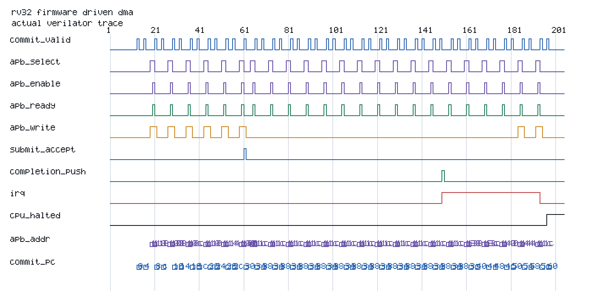

# Debug Case Study: RV32 Firmware-Driven DMA

## Scenario

The `dma_smoke` ROM program stages a descriptor through APB MMIO, writes the DMA doorbell, polls IRQ status, reads completion tag/status/word count, pops the completion, and halts.

## Checking

- APB assertions require setup/access ordering, stable controls during waits, and retirement only after `PREADY`.
- End-to-end checks require the firmware doorbell before descriptor acceptance and a prior accepted descriptor before software observes completion.
- The independent Python AES model supplies the expected destination scratchpad image.

## Waveform Evidence

The trace is generated from an actual Verilator event CSV. It shows RV32 instruction commits, APB handshakes, descriptor acceptance, completion push, level IRQ, completion service, and the final `EBREAK` halt.

## Result

The firmware suite reports `12 / 12` passing scenarios, `30 / 30` firmware/MMIO and outcome points, `7 / 7` required crosses, zero assertion failures, and zero destination-memory mismatches.
