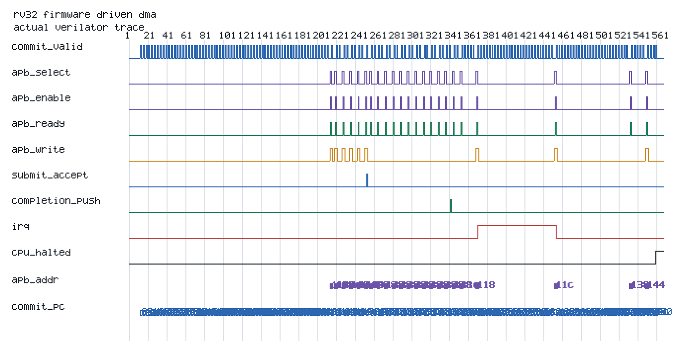

# Debug Case Study: Incorrect `MRET` Resume PC

## Scenario

The GCC-built `apb_wait_trap` firmware performs a valid wait-stated APB access, an out-of-range access, and a deliberately misaligned load. The trap handler records the exception, advances `mepc` past the faulting instruction, and returns with `MRET`.

## Injected Failure

`RV32_BUG_MRET_SKIP` changes the RTL return target from `mepc` to `mepc + 4`. This models a realistic trap-state integration bug that silently skips the first instruction after an exception.

## Detection

- `a_rv32_mret_returns_mepc` fails when the retirement record reports the wrong next PC.
- The independent RV32 checker compares the `MRET` architectural transition against the saved `mepc`.
- `make -C chiplet_extension firmware-c-mutation-check` runs the mutation twice:
  once with SVA enabled and once without assertion aborts so the independent
  architectural checker can capture the first divergent retirement. Both
  detection paths are required in `firmware_c_mutation_summary.csv`.

## Debug Evidence

The normalized RVFI trace exposes instruction, current/next PC, trap/interrupt flags, register effects, memory masks, and machine CSR state. The deterministic firmware waveform additionally correlates CPU retirement, APB wait states, DMA acceptance/completion, and IRQ activity.

## Resolution

The nominal RTL returns directly to `mepc`. The eleven compiled programs then pass with zero unexpected ISS mismatches, while the mutation remains an expected checker failure. This demonstrates checker sensitivity without counting the injected failure as normal closure.
