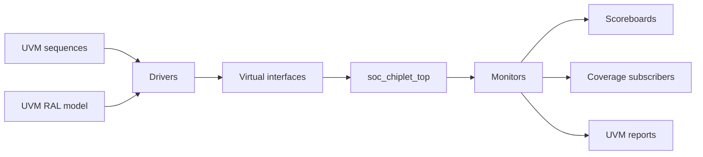

# UVM Lane Status

The chiplet project includes a parallel UVM lane as methodology collateral. It
is not the default verification gate; the default gate remains the non-UVM
Verilator closure flow.

## What Is Checked In

- `chiplet_extension/sim/tb_chiplet_uvm.sv`
- `chiplet_extension/sim/uvm/ucie_uvm_pkg.sv`
- `chiplet_extension/sim/uvm/dma_uvm_pkg.sv`
- `chiplet_extension/sim/uvm/power_uvm_pkg.sv`
- `chiplet_extension/sim/uvm/axi_lite_ral_pkg.sv`
- `chiplet_extension/sim/uvm/chiplet_uvm_pkg.sv`

The packages define UCIe, DMA/CSR, power, and top-level environment
components with UVM-style sequence items, drivers, monitors, scoreboards,
coverage subscribers, virtual-interface plumbing, and an optional AXI-Lite
RAL model for the DMA/power CSR map.

## Component Shape



## Supported Use

The primary supported command is:

```bash
make -C chiplet_extension uvm-smoke
```

The pinned real-UVM CI contract runs:

```bash
make -C chiplet_extension uvm-ci
```

It uses Verilator `v5.048` and `uvm-verilator` commit
`656f20d087370a7c742e00188d20bbf30fa95339`, then runs PRBS, DMA queue,
power sleep/resume, and AXI-Lite RAL smoke tests. Passing requires zero
`UVM_ERROR`, zero `UVM_FATAL`, and expected scoreboard transactions.

Current measured result: `4 / 4` tests pass with zero `UVM_ERROR` and zero
`UVM_FATAL`. The lane executes `run_test()`, UVM phases, sequencers/drivers,
TLM analysis connections, scoreboards, coverage subscribers, and RAL
frontdoor prediction. Native covergroups remain mirrored into CSV counters
because Verilator does not provide the same coverage database as a commercial
simulator.

The optional RAL smoke command is:

```bash
make -C chiplet_extension uvm-ral-smoke
```

That target drives the DMA/power CSR map through the AXI-Lite CSR bridge
frontdoor when `VERILATOR_UVM` and `UVM_HOME` point to a UVM-capable setup.
The existing directed `make -C chiplet_extension axi-lite-check` remains the
local AXI protocol-quality gate.

It requires a UVM-capable Verilator setup through `VERILATOR_UVM` and
`UVM_HOME`. The local Debian Verilator `5.020` path is not treated as a full
UVM environment. The `advanced-dv-evidence` GitHub workflow owns the pinned
execution contract.

## Compatibility Limitation

The pinned Verilator `5.048` flow uses the normal `run_test()` path. A
compatibility runner remains for older Verilator builds that cannot execute
the same phase/TLM path. Neither path replaces the stable non-UVM closure gate.
The pinned compile suppresses Verilator's `IMPURE` diagnostic for class-driven
virtual-interface tasks; the same CSR/AXI handshakes are independently checked
by the non-UVM directed protocol benches.

## Closure Position

`make -C chiplet_extension closure-equivalence` remains available when the
external UVM environment is valid. It is intended to compare UVM and non-UVM
coverage vectors, power-proxy evidence, and expected bug-validation outcomes.

The project should be described as:

- default closure: non-UVM Verilator stable gate
- optional methodology collateral: UVM architecture and smoke lane
- optional register methodology collateral: UVM RAL AXI-Lite frontdoor smoke
- environment-dependent comparison: UVM/non-UVM closure equivalence

It should not be described as commercial-simulator UVM signoff.
